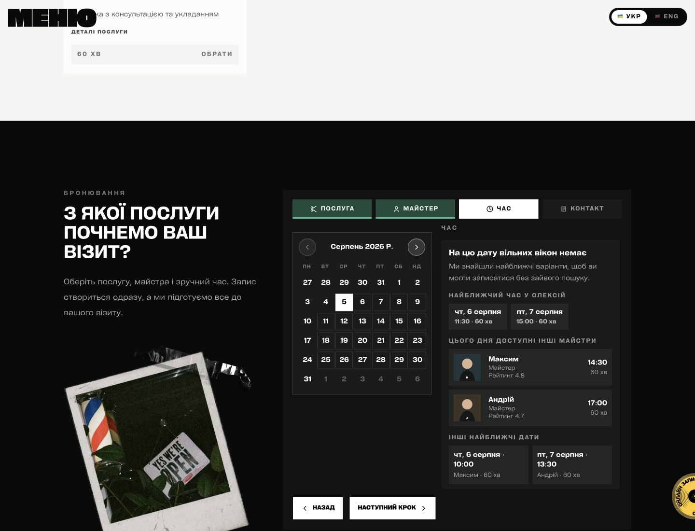
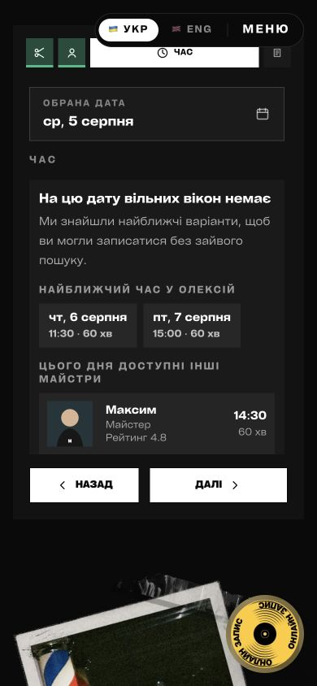

# Нет свободного времени: альтернативы и лист ожидания

## Проблема

Раньше клиент выбирал услугу, мастера и дату, но при отсутствии свободного времени видел тупиковое сообщение. Ему приходилось самостоятельно начинать поиск заново, поэтому часть клиентов могла уйти без записи.

## Решение

Теперь сайт сразу предлагает:

- ближайшее время у выбранного мастера;
- других подходящих мастеров в этот день;
- свободное время на ближайшие даты;
- лист ожидания на случай отмены другой записи.

При выборе альтернативы сайт повторно проверяет, что время ещё свободно, и продолжает обычную запись.

## Как это выглядит

### Компьютер

### Телефон — доступные варианты

### Телефон — ближайшие даты и лист ожидания

## Лист ожидания

Клиент оставляет имя, телефон, предпочтения по мастеру и дате, а также согласие на SMS.

Это не готовая запись. Если время освободится, клиент получит SMS и должен будет его подтвердить по безопасной ссылке.

## Для администратора

В backoffice появился блок с основными показателями:

- сколько клиентов не нашли время;
- сколько альтернатив было показано;
- сколько записей удалось вернуть;
- сколько создано заявок и принято предложений из листа ожидания;
- сколько отменённых слотов удалось заполнить.

Полноценное управление заявками пока не добавлено, потому что backend ещё не предоставляет необходимые административные методы.

## Дополнительно

- Интерфейс работает на украинском и английском языках.
- Поддерживаются несколько услуг и мобильная версия.
- Имена, телефоны и секретные ссылки не отправляются в аналитику.
- Одноразовый токен хранится во фрагменте ссылки и не попадает в CDN или access logs; при подтверждении он отправляется только в теле POST-запроса.
- Решение проверено тестами, typecheck, production build и локальными smoke-тестами.
- Деплой на production не выполнялся.
